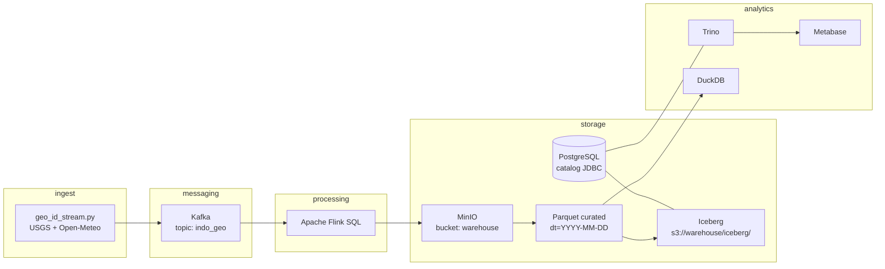

# streaming-geo-pipeline

Laboratorium *modern data engineering* lokal: **ingest geo & cuaca Indonesia** → **Apache Kafka** → **Apache Flink** → **MinIO (S3-compatible)**. Dilengkapi query **Parquet** (DuckDB), **Apache Iceberg** (catalog JDBC + Trino), dan **Metabase** untuk BI.

## Gambaran arsitektur



## Prasyarat

- [Docker](https://docs.docker.com/get-docker/) + Docker Compose
- Python 3.10+ (untuk producer & skrip bantu)

## Mulai cepat

1. **Salin kredensial**

   ```bash
   cp credentials.env.example credentials.env
   ```

   Isi `MINIO_ROOT_USER` / `MINIO_ROOT_PASSWORD` (dan ubah dari default untuk lingkungan nyata).

2. **Naikkan stack** (build pertama kali membutuhkan waktu untuk image Flink & Trino):

   ```bash
   docker compose up -d --build
   ```

   Atau: `scripts/up.sh` / `scripts/up.ps1`

3. **Aktifkan alur data**

   ```bash
   cd python
   pip install -r requirements.txt
   python geo_id_stream.py
   ```

4. **Jalankan job Flink** (di host dengan `docker` / `bash`, dari root repo):

   - Log ke TaskManager: `scripts/run_flink_sql.sh`
   - Raw JSON ke MinIO: `scripts/run_flink_minio_sql.sh`
   - **Parquet curated**: `scripts/run_flink_curated_parquet.sh`

5. **MinIO Console**: [http://localhost:9001](http://localhost:9001) — bucket `warehouse`, prefiks `geo-events/`.

6. **Flink UI**: [http://localhost:8081](http://localhost:8081)

## Port & layanan

| Layanan        | Port host | Catatan                                      |
|----------------|-----------|----------------------------------------------|
| Kafka (host)   | 9092      | Internal Docker: `kafka:29092`               |
| Zookeeper      | 2181      |                                              |
| MinIO API      | 9000      | S3-compatible                                |
| MinIO Console  | 9001      |                                              |
| Flink          | 8081      |                                              |
| PostgreSQL     | 5432      | User/db `iceberg` (metadata Iceberg)         |
| Trino          | 8082      | HTTP → catalog `iceberg`                     |
| Metabase       | 3030      | BI → sambungkan ke Trino (host `trino`:8080) |

## Struktur repo (ringkas)

| Path | Isi |
|------|-----|
| `docker-compose.yml` | Seluruh layanan + volume |
| `Dockerfile.flink` | Flink 1.18 + connector Kafka, Parquet, S3, Hadoop uber |
| `Dockerfile.trino` | Trino + JDBC driver PostgreSQL untuk catalog Iceberg |
| `config/trino/` | Konfigurasi coordinator & catalog Iceberg → MinIO |
| `jobs/*.sql` | Job SQL Flink (print, JSON ke MinIO, Parquet curated) |
| `python/geo_id_stream.py` | Producer ke topic `indo_geo` |
| `python/query_curated_parquet.py` | Baca Parquet di MinIO via DuckDB + boto3 |
| `python/curated_to_iceberg.py` | Muat Parquet curated → tabel Iceberg |
| `use_case/pipeline_flow.txt` | Urutan jalan & catatan stack |
| `use_case/iceberg_bi.txt` | Iceberg, Trino, Metabase langkah demi langkah |

## Iceberg & Metabase

- Setelah ada data **Parquet** di `geo-events/curated/`, isi tabel Iceberg:

  ```bash
  python python/curated_to_iceberg.py --replace
  ```

- Tabel: `iceberg.curated.geo_curated` (partisi `dt`).
- **Metabase**: [http://localhost:3030](http://localhost:3030) — tambah database **Trino**; host `trino`, port `8080`, catalog `iceberg`, schema `curated`.

Detail sinkronisasi kunci MinIO antara `credentials.env` dan `config/trino/catalog/iceberg.properties` ada di [`use_case/iceberg_bi.txt`](use_case/iceberg_bi.txt).

## Query Parquet (tanpa Iceberg)

```bash
python python/query_curated_parquet.py
python python/query_curated_parquet.py --dt 2026-04-04 --limit 50
```

## Keamanan & produksi

- **Jangan** meng-commit `credentials.env` (sudah di `.gitignore`).
- Default `minioadmin` dan kunci di `docker-compose` / Trino hanya untuk **lokal**; samakan kredensial jika Anda mengubah user MinIO, dan perbaharui `fs.s3a.*` di Flink serta `s3.*` di catalog Trino.
- Untuk deployment nyata: TLS, secret manager, autentikasi Trino/Metabase, backup Postgres (metadata catalog) dan kebijakan bucket.

## Lisensi

Proyek pribadi / pembelajaran — tambahkan lisensi jika akan dipublikasikan sebagai open source.

## Repo

[https://github.com/hrizriz/streaming-geo-pipeline](https://github.com/hrizriz/streaming-geo-pipeline)
